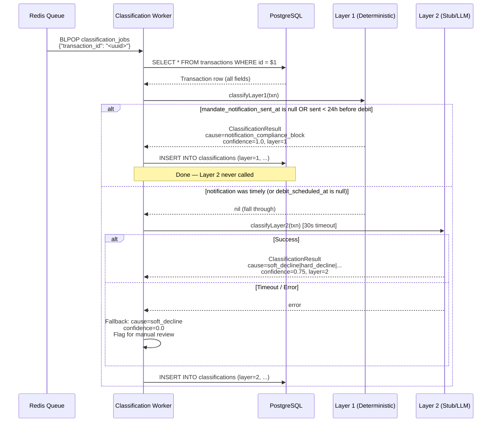

# Classification Flow — Layer 1 → Layer 2 → Persist

**Service:** Classification Service (queue worker)  
**Trigger:** Job dequeued from `classification_jobs` Redis list

---

## Flow Diagram



---

## Layer 1 Decision Logic

```
IF txn.debit_scheduled_at IS NULL:
    → fall through to Layer 2 (cannot make determination)

required_deadline = debit_scheduled_at - 24h

IF mandate_notification_sent_at IS NULL
   OR mandate_notification_sent_at > required_deadline:
    → cause = notification_compliance_block
    → confidence = 1.0
    → action = silent_reschedule
ELSE:
    → fall through to Layer 2
```

---

## Layer 2 Stub Heuristic (replace with LLM)

| status_code / bank_response_code signals | Cause | Action |
|------------------------------------------|-------|--------|
| TIMEOUT, GATEWAY_ERROR, NETWORK | `gateway_fault` | `retry_scheduled` |
| Bank codes 59/14/57, FRAUD, BLOCKED | `fraud_filter_block` | `do_not_retry` |
| Bank codes 05/12/41/43/54, INVALID_CARD, EXPIRED | `hard_decline` | `do_not_retry` |
| Everything else | `soft_decline` | `retry_scheduled` |

---

## Layer 2 Failure Path

If Layer 2 fails (timeout / schema error):
- Fallback classification written: `soft_decline`, confidence=0.0, model_version=`"fallback"`
- Transaction **not** dropped — always produces a classification row
- Operator should monitor for `confidence=0.0` rows as a manual review queue
