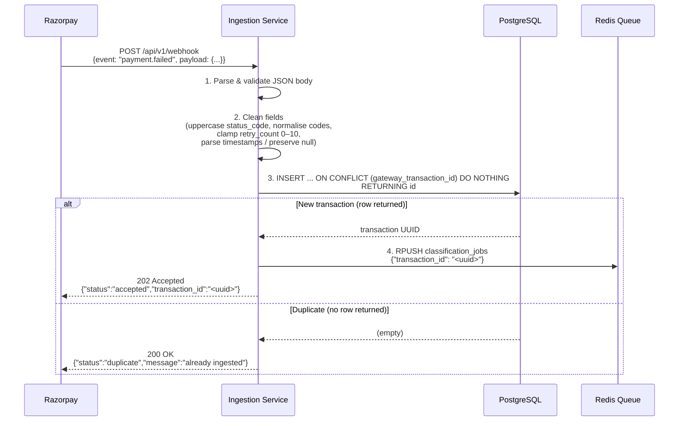

# Ingestion Flow — Webhook to Queue

**Service:** Ingestion Service (`:3001`)  
**Trigger:** Razorpay `payment.failed` webhook

---

## Flow Diagram

---

## Field Cleaning Rules Applied

| Field | Rule |
|-------|------|
| `status_code` | Uppercase + trim; map synonyms (`TIMED_OUT`→`TIMEOUT`) |
| `bank_response_code` | Pass through as-is; normalisation done in classification |
| `retry_count_so_far` | Clamp to `[0, 10]`; log if out of range |
| `mandate_notification_sent_at` | Parse RFC3339; **null stays null** (never fabricated) |
| `debit_scheduled_at` | Parse RFC3339; **null stays null** |
| `amount` | Passed as float; reject on parse failure |

---

## Error Paths

| Scenario | Response |
|----------|---------|
| Malformed JSON | `400 INVALID_BODY` |
| DB upsert error | `500 DB_ERROR` |
| Redis enqueue error | `500 QUEUE_ERROR` (transaction already persisted) |
| Duplicate webhook | `200` (acknowledged, not re-processed) |
