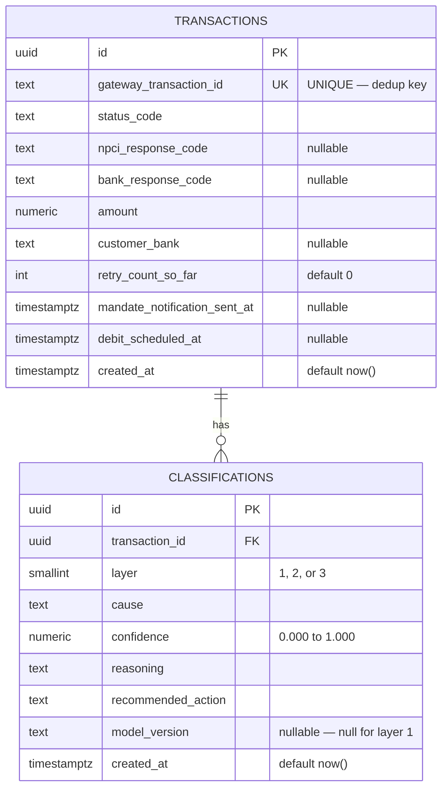

# Database Documentation
# Feature 1 — Root-Cause Classifier

**Database:** PostgreSQL 15  
**Migration file:** `db/migrations/001_init.sql`

---

## Entity-Relationship Diagram



---

## Table: `transactions`

| Column | Type | Nullable | Default | Notes |
|--------|------|----------|---------|-------|
| `id` | `uuid` | No | `gen_random_uuid()` | PK |
| `gateway_transaction_id` | `text` | No | — | UNIQUE — dedup key |
| `status_code` | `text` | No | — | Normalised at ingestion |
| `npci_response_code` | `text` | Yes | NULL | |
| `bank_response_code` | `text` | Yes | NULL | |
| `amount` | `numeric` | No | — | Fixed-precision |
| `customer_bank` | `text` | Yes | NULL | Canonical bank name |
| `retry_count_so_far` | `int` | No | `0` | Clamped to 0–10 |
| `mandate_notification_sent_at` | `timestamptz` | Yes | NULL | **Preserve null** — null ≠ "not sent" for all banks |
| `debit_scheduled_at` | `timestamptz` | Yes | NULL | |
| `created_at` | `timestamptz` | No | `NOW()` | |

**Indexes:**
- `PRIMARY KEY (id)`
- `UNIQUE (gateway_transaction_id)` — enforces dedup at DB level
- `INDEX idx_transactions_gateway_id` — fast lookup during dedup

---

## Table: `classifications`

| Column | Type | Nullable | Default | Notes |
|--------|------|----------|---------|-------|
| `id` | `uuid` | No | `gen_random_uuid()` | PK |
| `transaction_id` | `uuid` | No | — | FK → transactions.id |
| `layer` | `smallint` | No | — | CHECK IN (1, 2, 3) |
| `cause` | `text` | No | — | One of 5 causes |
| `confidence` | `numeric(4,3)` | No | — | 0.000 – 1.000 |
| `reasoning` | `text` | No | — | Human-readable explanation |
| `recommended_action` | `text` | No | — | Stored at classification time |
| `model_version` | `text` | Yes | NULL | NULL for Layer 1 (deterministic) |
| `created_at` | `timestamptz` | No | `NOW()` | |

**Indexes:**
- `PRIMARY KEY (id)`
- `INDEX idx_classifications_transaction_id` — join performance
- `INDEX idx_classifications_cause` — filter by cause in audit API

---

## Key Design Decisions

### Why `recommended_action` is stored (not derived)
The audit trail (Feature 7) must show what action was recommended at the *moment of classification*, even if routing logic changes in a future deploy. Storing it as a column makes the record immutable.

### Why `mandate_notification_sent_at` is nullable (not defaulted)
Layer 1 treats `null` as "notification was not sent." If a missing field were defaulted to a fake timestamp, the deterministic rule would produce false negatives. Null must remain distinguishable from any real timestamp.

### Why `model_version` is nullable
Layer 1 is a deterministic rule — there is no model. Setting it to null makes the distinction explicit and queryable.

### Dedup: `ON CONFLICT DO NOTHING` vs `DO UPDATE`
`DO NOTHING` is intentional — we never want to overwrite a transaction row that is already being classified. An update could corrupt in-progress classification jobs.

---

## Queries Used by Each Service

### Ingestion Service
```sql
-- Atomic upsert
INSERT INTO transactions (...) VALUES (...)
ON CONFLICT (gateway_transaction_id) DO NOTHING
RETURNING id;
```

### Classification Service
```sql
-- Fetch for classification
SELECT * FROM transactions WHERE id = $1;

-- Persist result
INSERT INTO classifications (...) VALUES (...);
```

### Audit Service
```sql
-- Joined list (paginated, filterable)
SELECT c.*, t.gateway_transaction_id, t.status_code, ...
FROM classifications c
JOIN transactions t ON t.id = c.transaction_id
WHERE ($1 = '' OR c.cause = $1)
  AND ($2 = 0  OR c.layer = $2)
ORDER BY c.created_at DESC
LIMIT $3 OFFSET $4;
```
