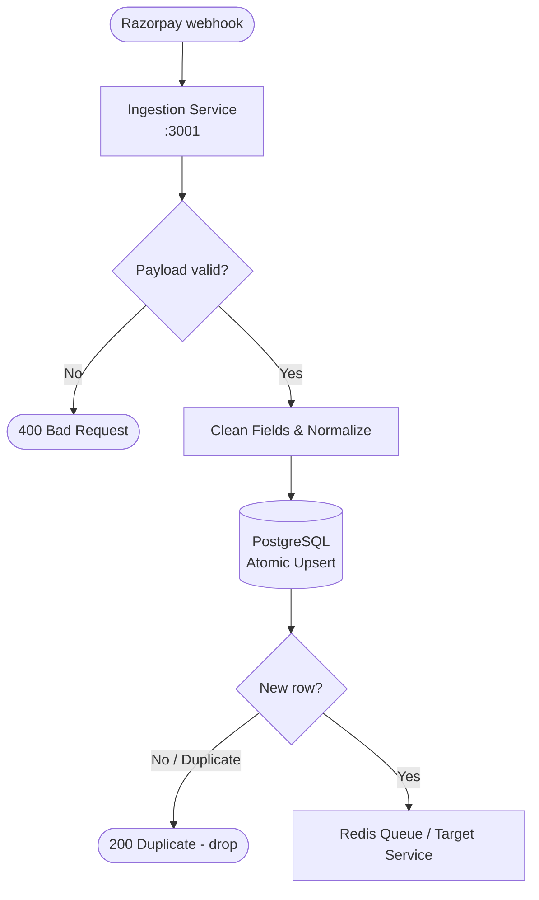
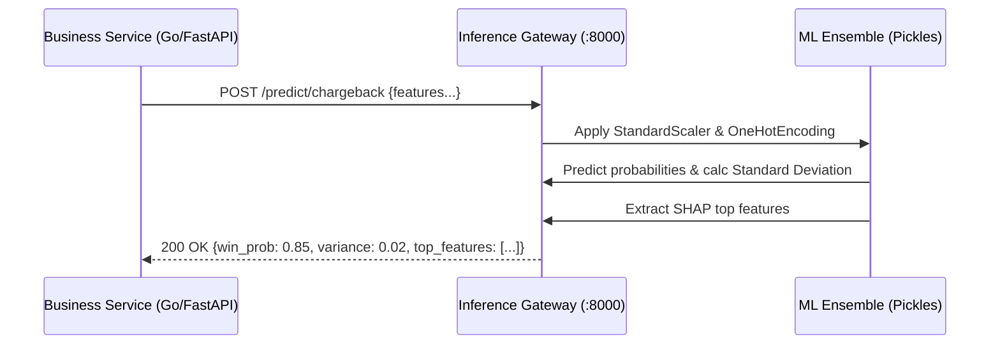

# Data Pipeline & Machine Learning Processing

**Scope:** End-to-end data flow from webhooks, to Database insertion, to ML Feature Engineering, and final inference.

---

## 1. Operational Ingestion Pipeline

When Razorpay triggers webhooks (e.g., `payment.failed` or `dispute.created`), the data flows through strict validation and deduplication layers before reaching the inference layer.

### Deduplication Strategy
To handle Razorpay's at-least-once delivery guarantee, the DB executes:
`INSERT ... ON CONFLICT (gateway_transaction_id) DO NOTHING`.
This guarantees exactly-once processing for downstream services.

---

## 2. ML Data Processing & Feature Engineering

Before querying the ML model, the backend services (`chargeback-service` / `classification-service`) shape the raw JSON into exact feature vectors.

### 2.1 PII Isolation Boundary
The ML models operate exclusively on metadata. Customer identities are strictly scrubbed:
- **✅ Permitted Features:** `status_code`, `reason_code`, `amount_paise`, `has_3ds_auth`, `days_remaining`
- **❌ Scrubbed:** Customer Name, Account Number, VPA, PAN, email.

### 2.2 Continuous Training Pipeline (SMOTE)
Offline training scripts manage data imbalance (e.g., `soft_decline` accounts for 80%+ of volume; `fraud` is rare).
1. **Synthetic Noise Injection:** Introduces realistic data anomalies to increase model robustness.
2. **SMOTE Balancing:** Uses Synthetic Minority Over-sampling Technique (SMOTE) to generate examples for minority classes.
3. **Serialization:** Feature scalers, Encoders, and Estimators are pickled into `.pkl` files and mounted into the `inference-service`.

---

## 3. The Inference Gateway Flow

We utilize a centralized Inference Gateway to isolate heavy dependencies (`scikit-learn`, `lightgbm`) from the business logic.

### 3.1 Inference Telemetry
The Inference Gateway automatically flags structural model disagreement:
- If standard deviation (variance) > `0.15`, the `disagreement_flag` is set to `true`.
- The Business Service intercepts this flag and overrides the ML recommendation (usually deflecting to a manual human review or a refund fallback).
