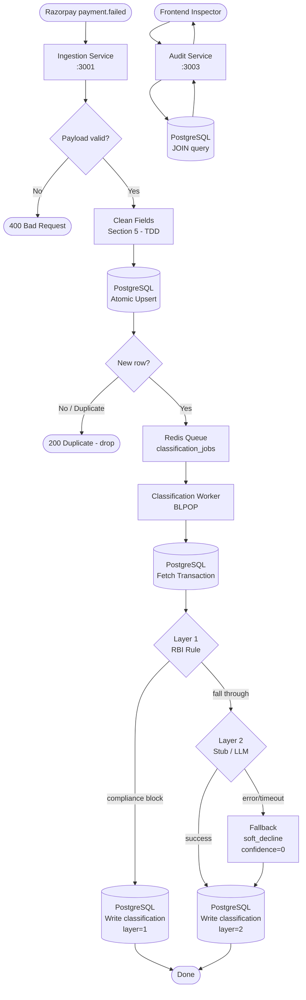

# Data Pipeline — End-to-End Flow

**Scope:** Full journey from Razorpay webhook to Frontend Inspector

---

## Pipeline Diagram



---

## Feature Enrichment (Before Layer 2)

The classification worker enriches the raw transaction before it reaches Layer 2:

| Derived Field | How Computed |
|---------------|-------------|
| `time_since_last_failure` | `SELECT MAX(created_at) FROM transactions WHERE gateway_transaction_id != $current AND customer_bank = $bank` |
| `retry_count_so_far` | Read directly from `transactions.retry_count_so_far` (set at ingestion) |
| `bank_response_code` (normalised) | Normalised by ingestion cleaning; Layer 2 sees canonical form |

> **Note:** `time_since_last_failure` enrichment is planned for the real LLM integration. The current stub uses only the fields present in the transaction row.

---

## Deduplication Strategy

```
Razorpay at-least-once delivery
         │
         ▼
INSERT ... ON CONFLICT (gateway_transaction_id) DO NOTHING
         │
    ┌────┴────┐
    │         │
  New row   No row returned
    │         │
  Enqueue   DROP (already processed)
```

**Why atomic?** Two copies of the same webhook can arrive concurrently. A read-then-write check (SELECT then INSERT) would let both pass the SELECT before either writes, creating double classifications.

---

## PII / Compliance Boundary

```
What goes to Layer 2 (LLM):
  ✅ status_code
  ✅ npci_response_code
  ✅ bank_response_code
  ✅ amount
  ✅ customer_bank
  ✅ retry_count_so_far
  ✅ time_since_last_failure

What NEVER goes to Layer 2:
  ❌ Customer name
  ❌ Account number
  ❌ Card PAN
  ❌ Any direct customer identifier
```
