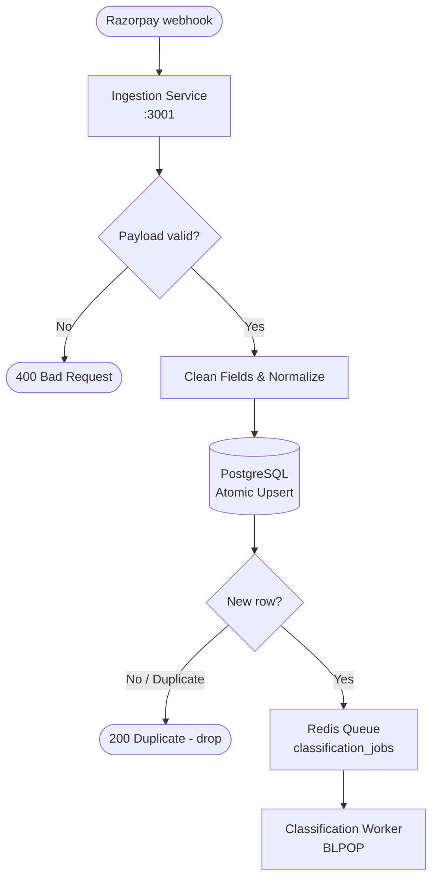
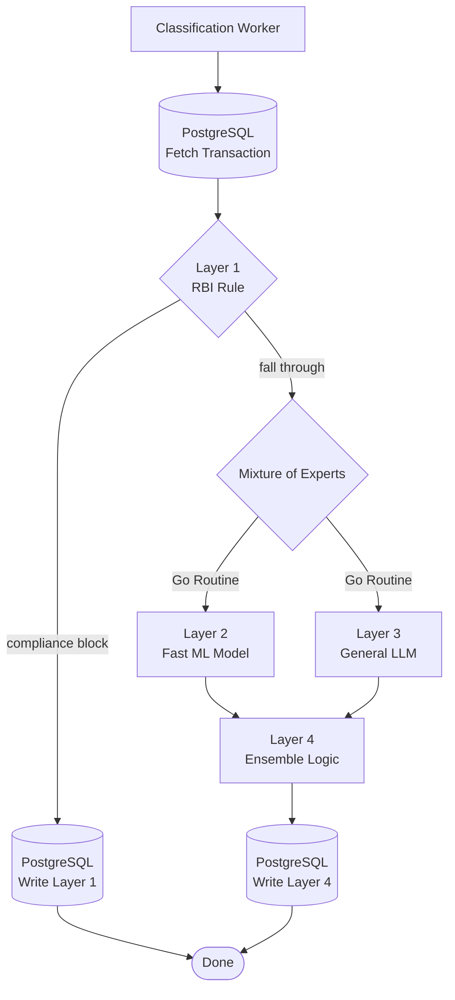

# Data Pipeline & Machine Learning Processing

**Scope:** End-to-end data flow from webhooks, to Database insertion, to ML Feature Engineering, and final inference.

---

## 1. Operational Ingestion Pipeline

When Razorpay triggers a `payment.failed` webhook, the data flows through strict validation and deduplication layers before any ML inference occurs.

### Deduplication Strategy
To handle Razorpay's at-least-once delivery guarantee, the DB executes:
`INSERT ... ON CONFLICT (gateway_transaction_id) DO NOTHING`.
This guarantees exactly-once processing for the Machine Learning queue.

---

## 2. ML Data Processing & Feature Engineering

Before the classification worker queries the ML model, it extracts and shapes the raw webhook JSON into the exact feature vector the model was trained on.

### 2.1 PII Isolation Boundary
The ML models operate exclusively on metadata. Customer identities are strictly scrubbed:
- **✅ Permitted Features:** `status_code`, `npci_response_code`, `bank_response_code`, `amount_paise`, `customer_bank`, `retry_count_so_far`
- **❌ Scrubbed:** Customer Name, Account Number, VPA, PAN, email.

### 2.2 Continuous Training Pipeline (SMOTE)
The `datasets/scripts/train_layer2_model.py` script powers the offline training loop. Because payment failures exhibit extreme class imbalance (e.g. `soft_decline` accounts for 80%+ of real-world volume):

1. **Synthetic Noise Injection:** We introduce realistic data anomalies (null NPCI codes, unexpected bank strings) to increase model robustness.
2. **SMOTE Balancing:** We use Synthetic Minority Over-sampling Technique (SMOTE) to synthetically generate examples for minority classes (like `fraud_filter_block`). This mathematically guarantees the Random Forest model does not blindly default to the majority class.
3. **Serialization:** The final feature scaler, One-Hot Encoders, and Random Forest estimators are pickled into `layer2_payment_failure_model.pkl`.

---

## 3. The Inference Flow (Mixture of Experts)

Once queued, the transaction is picked up by the Go worker and routed through the inference pipeline.

### Ensemble Merge Logic
- **Layer 2 (ML)** outputs `[cause, confidence]`.
- **Layer 3 (LLM)** outputs `[cause, reasoning]`.
- **Layer 4 (Ensemble)** merges them: If ML confidence is mathematically strong (`> 0.85`), the ML model's domain expertise dominates the final decision. If the ML model encounters an unseen edge-case (`< 0.85`), the LLM acts as the zero-shot tie-breaker.
