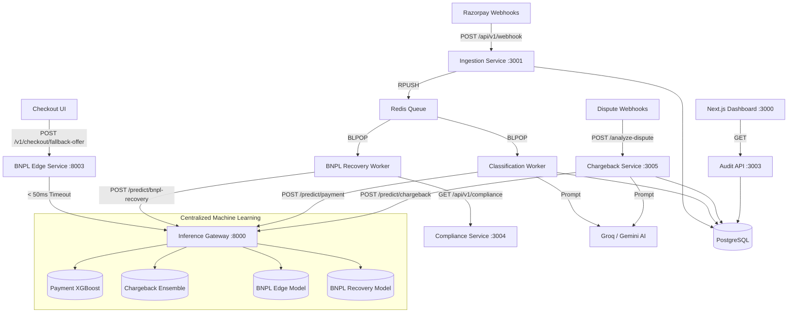

# High-Level Design (HLD)
# Razorpay AI Buildathon 2026 Enterprise Monorepo

**Version:** 2.0  
**Last Updated:** 2026-08-28  
**Author:** Engineering Team  
**Status:** Approved for Implementation

---

## 1. Problem Statement

This enterprise monorepo solves two major operational bottlenecks for Razorpay:
1. **Pillar A (Chargebacks):** Manual dispute resolution is costly and slow. The **Chargeback Pre-emption Service** uses Machine Learning to predict dispute win probabilities and autonomous LLMs to draft compelling rebuttals, deflecting unwinnable disputes via refunds.
2. **Pillar B (Diagnostics):** When payments fail, the system cannot programmatically determine the root cause. The **Root-Cause Classifier** uses a Mixture-of-Experts (ML + LLM) to instantly classify failures (e.g., fraud block vs. soft decline).
3. **Pillar C (BNPL Recovery):** Declines and defaults represent massive lost revenue. The **Dual-Engine BNPL System** utilizes a 50ms Edge Engine to save live checkouts with BNPL offers, and an asynchronous Recovery Engine that predicts optimal Dunning channels based on "Phantom Debt" while strictly adhering to DPDP and RBI Anti-Harassment laws.

To achieve maximum scalability, all heavy Machine Learning (XGBoost, LightGBM, Scikit-learn) is abstracted away from the lightweight Go/Python backend services into a centralized **Inference Gateway**.

---

## 2. System Architecture

---

## 3. Services

| Service | Port | Technology | Role |
|---------|------|------------|------|
| **Inference Service** | 8000 | FastAPI (Python 3.11) | Centralized ML Gateway hosting XGBoost, LightGBM, and BNPL Random Forest models in memory. |
| **BNPL Edge Service** | 8003 | Go (Fiber) | Ultra-low latency edge proxy that executes checkout fallbacks with a strict 50ms SLA. |
| **Chargeback Service** | 3005 | FastAPI (Python 3.11) | Executes deterministic logic (VAMP protection), routes to Inference Gateway, and drafts LLM rebuttals. |
| **Classification Service**| — | Go (Workers) | Pops webhooks off Redis for Root-Cause classification and BNPL Asynchronous Recovery orchestration. |
| **Compliance Service** | 3004 | FastAPI (Python 3.11) | Enforces strict RBI regulations (IST timeframes) and DPDP consent mapping via Redis rate limiting. |
| **Ingestion Service** | 3001 | Go (Fiber) | Webhook receiver; handles payload validation, DB dedup, and Redis enqueuing. |
| **Audit Service** | 3003 | Go (Fiber) | Read-only API for the Frontend Inspector to query classifications and chargebacks. |
| **Frontend Dashboard** | 3000 | Next.js (SSR) | Unified Operations Dashboard UI. |

---

## 4. Architectural Patterns

### 4.1 The Inference Gateway Pattern
Instead of bundling large ML dependencies (NumPy, SciPy, LightGBM) directly into the business logic microservices, we offload all prediction requests over HTTP to the `inference-service`.
- **Pros:** Keeps the business microservices lightweight, allowing them to scale independently. Prevents dependency conflicts between Go services and Python ML libraries.
- **Fault Tolerance:** If the inference service is unavailable, the `chargeback-service` falls back to its deterministic rule engine or routes the case for manual review.

### 4.2 Mixture of Experts (MoE) & SHAP Injection
The system combines the speed of structured ML with the reasoning power of LLMs:
1. **TreeSHAP Extraction**: The Inference Gateway executes the ML prediction and uses SHAP to extract the top defining features (e.g., "Amount > 50k", "No 3DS Auth").
2. **Context Injection**: These SHAP features are dynamically injected into the system prompt of the LLM.
3. **Multi-LLM Ensemble**: The system queries both Groq (Llama 3) and Gemini concurrently, scoring their generated text against the hard evidence, and returning the most accurate rebuttal.

### 4.3 DPDP-Compliant Signal Decay
To power the BNPL Asynchronous Recovery engine, the system utilizes "Phantom Debt" signals (external ecosystem debt). However, to remain strictly compliant with the Digital Personal Data Protection (DPDP) Act of 2023, the architecture uses a preprocessing gate:
1. **Exponential Decay**: Debt signals degrade with a 30-day half-life to prevent harassing users based on stale data.
2. **Consent Revocation Gate**: If a user invokes their Right to Erasure, the signal is deterministically zeroed out before touching the Random Forest to prevent a chilling effect, forcing the model to rely solely on internal first-party signals.

### 4.4 VAMP Protection (Deflection Layer)
Visa requires merchants to stay below a 1.5% dispute ratio (VAMP). The deterministic engine intercepts cases where the merchant is approaching this ratio and forcibly issues a refund (deflects the dispute) to protect their standing, overriding the ML probability engine if necessary.
