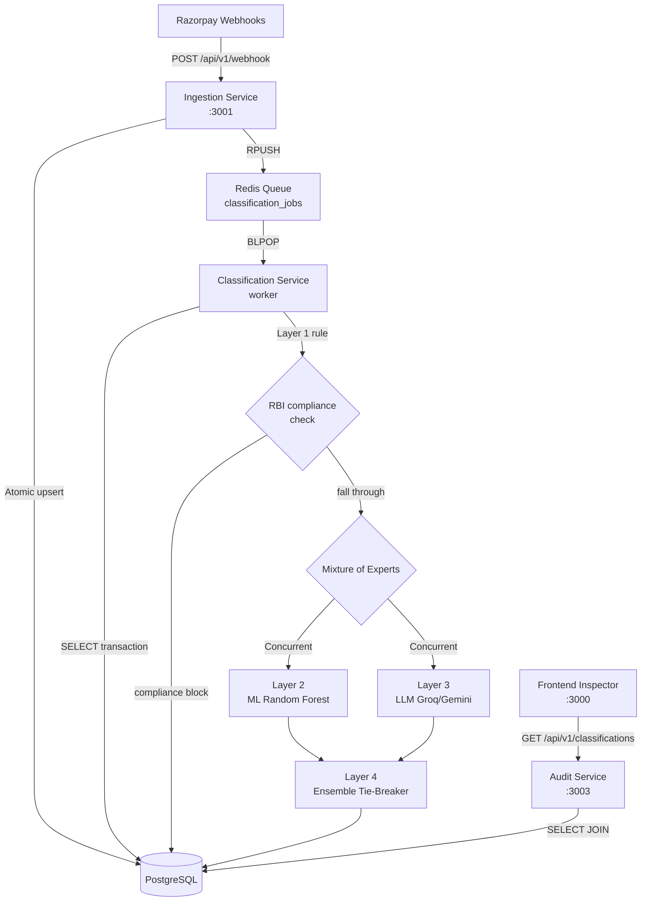
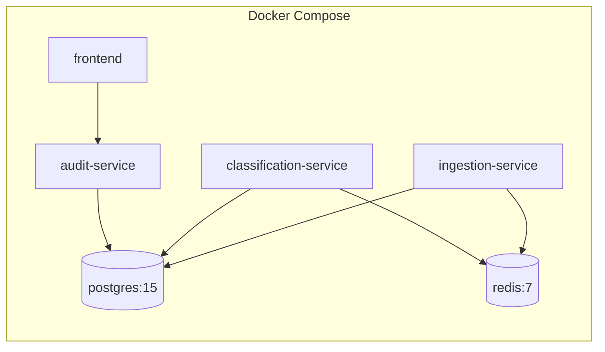

# High-Level Design (HLD)
# Feature 1 — Root-Cause Classifier

**Version:** 1.0  
**Last Updated:** 2026-08-22  
**Author:** Engineering Team  
**Status:** Approved for Implementation

---

## 1. Problem Statement

Razorpay processes millions of recurring mandate payments daily. When a payment fails, the current system cannot programmatically determine *why* it failed — teams rely on manual inspection of bank response codes that are inconsistent across issuers. This causes delayed recovery actions and poor customer experience.

**Feature 1** builds a hybrid Mixture-of-Experts automated classifier that:
1. Detects RBI notification-compliance violations deterministically (Layer 1)
2. Classifies all other failures into one of four causes by concurrently querying a fast Random Forest ML model (Layer 2) and a large language model (Layer 3).
3. Merges the results via an Ensemble tie-breaker (Layer 4) to maximize both latency and accuracy.

---

## 2. System Architecture



---

## 3. Services

| Service | Port | Role | Scales |
|---------|------|------|--------|
| **Ingestion Service** | 3001 | Webhook receiver; payload validation, dedup, enqueue | Horizontally (stateless) |
| **Classification Service** | — | Queue worker; Layer 1 + Layer 2; persists results | Horizontally (multiple workers) |
| **Audit Service** | 3003 | Read-only API for the Frontend Inspector | Horizontally (stateless) |
| **Frontend** | 3000 | Next.js Classifier Inspector UI | Horizontally |

---

## 4. Data Flow (End-to-End)

```
Razorpay
  │  payment.failed webhook (POST)
  ▼
Ingestion Service
  ├─ Validate payload structure
  ├─ Clean fields (uppercase, normalise codes, clamp retries)
  ├─ Atomic upsert → PostgreSQL (ON CONFLICT DO NOTHING)
  │   └─ Duplicate? → return 200 "duplicate", stop.
  └─ Enqueue ClassificationJob (transaction_id) → Redis
  
Classification Worker
  ├─ BLPOP from Redis queue
  ├─ Fetch full transaction from PostgreSQL
  ├─ Layer 1: RBI 24h notification rule
  │   └─ Match? → write classification (layer=1, confidence=1.0), done.
  └─ Mixture of Experts (Concurrent)
      ├─ Layer 2: Fast ML Random Forest Classifier (confidence + cause)
      ├─ Layer 3: General LLM API (reasoning + cause)
      └─ Layer 4: Ensemble Tie-Breaker
          ├─ Match? → Boost confidence to 0.99
          ├─ Disagree (ML High Conf > 0.85)? → Override LLM with ML cause
          ├─ Disagree (ML Low Conf < 0.85)? → Trust LLM reasoning
          └─ Write classification (layer=4, confidence=X.XX)

Audit Service
  └─ Frontend reads GET /api/v1/classifications?cause=&layer=
      └─ Joined view: classifications ⋈ transactions → JSON
```

---

## 5. Classification Taxonomy

| Cause | Layer | Trigger |
|-------|-------|---------|
| `notification_compliance_block` | 1 | RBI: notification missing or < 24h before debit |
| `soft_decline` | 2, 3, 4 | Transient issuer issue — retriable |
| `hard_decline` | 2, 3, 4 | Permanent issuer rejection — do not retry |
| `gateway_fault` | 2, 3, 4 | Timeout / technical failure at gateway |
| `fraud_filter_block` | 2, 3, 4 | Bank risk/fraud filter triggered |

---

## 6. Layer 4: Ensemble Tie-Breaker Logic
Because Layer 2 and Layer 3 execute concurrently, a deterministic Go routine (Layer 4) merges their outputs to finalize the decision:
- **Condition A (Agreement):** If `Layer_2_Cause == Layer_3_Cause`, the classification is locked with confidence `0.99`.
- **Condition B (ML Override):** If `Layer_2_Cause != Layer_3_Cause` AND `Layer_2_Confidence > 0.85`, the ML model's prediction overrides the LLM. 
- **Condition C (LLM Tie-Break):** If `Layer_2_Cause != Layer_3_Cause` AND `Layer_2_Confidence < 0.85`, the LLM's vast semantic reasoning breaks the tie, and its cause and confidence are used.

---

## 6. Recommended Actions

| Action | Meaning |
|--------|---------|
| `silent_reschedule` | Reschedule debit without alerting customer |
| `retry_now` | Retry immediately |
| `retry_scheduled` | Retry after a delay |
| `do_not_retry` | Permanent failure — notify customer |
| `reverify_and_reverse` | Reverify mandate and reverse if needed |

---

## 7. Infrastructure



---

## 8. Key Design Decisions

| Decision | Rationale |
|----------|-----------|
| Queue decouples ingestion from classification | Webhook must return fast; LLM calls can be slow/retried |
| Atomic DB upsert for dedup | Razorpay guarantees at-least-once delivery; concurrent duplicates would pass a non-atomic check |
| Layer 1 is a pure function | Zero dependencies, zero latency, deterministic — runs before any I/O |
| `recommended_action` stored at classification time | Audit trail must reflect the decision made *then*, not derived from current routing logic |
| Layer 4 Ensemble Tie-Breaker | Running ML and LLM concurrently merges domain expertise (ML) with vast semantic reasoning (LLM) without sacrificing latency. |

---

## 9. Open Issues (Pre-Build)

| # | Issue | Owner |
|---|-------|-------|
| 1 | Dedup must be atomic upsert, not read-then-write | Backend |
| 2 | `mandate_notification_sent_at` field coverage per bank needs auditing | Data/Backend |
| 3 | `least_aggressive_action` needs per-cause lookup table | Backend |
| 4 | LLM call needs timeout + retry + failure path | AI/Backend |
| 5 | Data residency / third-party API sign-off for RBI-governed fields | Legal/Infra |
| 6 | Synthetic validation set is directional only | AI |
