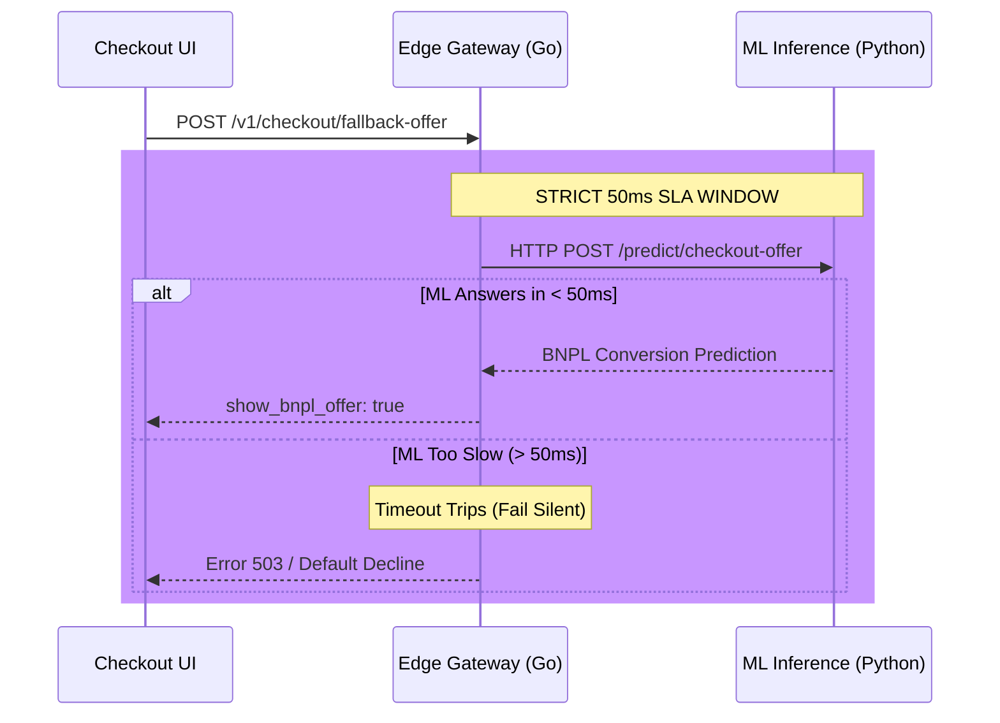

# BNPL Edge Service (Engine 1) — High-Level Design (HLD)

**Version:** 1.0  
**Author:** Engineering Team  
**Status:** Approved  

---

## 1. Problem Statement
When a customer experiences a payment decline (e.g., insufficient funds) during checkout, they typically abandon their cart, resulting in lost revenue. However, immediately injecting a "Buy Now, Pay Later" (BNPL) offer into the checkout UI can save the sale. The core challenge is latency: delaying the checkout flow by even a few hundred milliseconds causes conversion rates to drop. We must predict BNPL conversion probability in real-time without violating strict checkout latency SLAs.

## 2. Solution Overview
The `bnpl-edge-service` (Engine 1 of the Dual-Engine BNPL System) is an ultra-fast Go microservice acting as a real-time proxy. It intercepts transaction decline events and queries the centralized Python Inference Service. To protect checkout conversion, it enforces a hard 50ms circuit breaker: if the ML backend cannot respond within 50ms, the edge service fails silently, allowing the standard decline screen to render.

## 3. High-Level Architecture

## 4. Key Design Decisions

1. **Language Choice (Go + Fiber):** We chose Go for the Edge Gateway for its sub-millisecond overhead and highly efficient goroutine scheduling, ensuring the proxy itself adds virtually zero latency to the 50ms SLA.
2. **Fail-Silent Policy:** Timeouts in the critical checkout path are dictated by business SLAs, not by backend latency. If the ML model is too slow, we do not extend the timeout; we fail silently to preserve the user experience.
3. **Decoupled Machine Learning:** By keeping the Python Random Forest model in the `inference-service`, we can scale the Go Edge Gateway horizontally to handle massive checkout spikes without copying heavy Python ML dependencies across containers.
