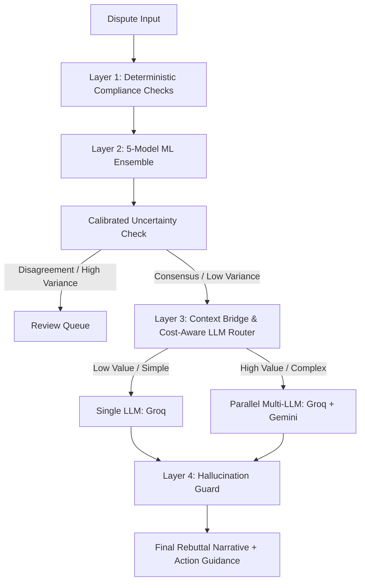

# Chargeback Pre-emption Service Architecture

## 1. Architectural Blueprint
The Chargeback Pre-emption Service is a production-grade automated triage and representment drafting pipeline integrated into the Razorpay payment dispute ecosystem.

---

## 2. Pipeline Layers

### Layer 1: Deterministic Compliance Pre-flight
- **Objective:** Evaluate baseline dispute characteristics and evidence completeness without calling downstream models.
- **NPCI & Card Network Rules:** Maps the 15 predefined dispute reason codes (Visa 10.4, Mastercard 4853, RuPay RU01, etc.) to exact evidence requirements and response deadlines.
- **Repeat Dispute Counting:** Flag customer profiles with elevated history of disputes (potential friendly-fraud).
- **VAMP Ratio Protection:** Checks the merchant's active chargeback ratio. If close to or exceeding the VAMP 1.5% limit, any low-win-probability dispute is redirected to instant deflection (refund) to protect the merchant's gateway credentials.

### Layer 2: ML Ensemble Layer
- **Ensemble Composition:** Employs a weighted 5-model ensemble comprising:
  1. Logistic Regression (Baseline)
  2. Random Forest
  3. Gradient Boosting (explainer)
  4. XGBoost
  5. LightGBM
- **Uncertainty Calibration:** Measures standard deviation (variance) of the predictions.
  - If $Var(P) > \theta_{calibrated}$ (where $\theta$ is the validation 5th percentile standard deviation), it indicates model disagreement. The dispute is flagged for manual review.
- **Tree SHAP Explainer:** The highest performing single model (Gradient Boosting) functions as the explainer. Top 3 features are extracted to feed key context into the next layer.

### Layer 3: Context Bridge & Cost-Aware LLM Routing
- **Context Bridge:** Transforms binary evidence fields and continuous metrics into a network-compliant system prompt, mapping required proof directly to present evidence.
- **Cost-Aware Routing:**
  - **Single LLM Routing (Groq/compound):** Applied for low-value disputes (< ₹5,000) or simple reason codes with consensus. Falls back to Gemini if Groq fails.
  - **Multi-LLM Ensemble Routing:** Applied for high-value disputes (>= ₹5,000) or cases of high variance/disagreement. Executes Groq and Gemini in parallel, scoring the narratives, and picking the one with the highest compliance coverage.

### Layer 4: Deterministic Hallucination Guard
- Runs regex-based scrubs on generated letters.
- Removes statistical metrics (e.g. "92% win probability") or ML terms to prevent compliance leakage to banks.
- Redacts ungrounded email placeholders, fake phone numbers, and LLM system prefix leaks.
