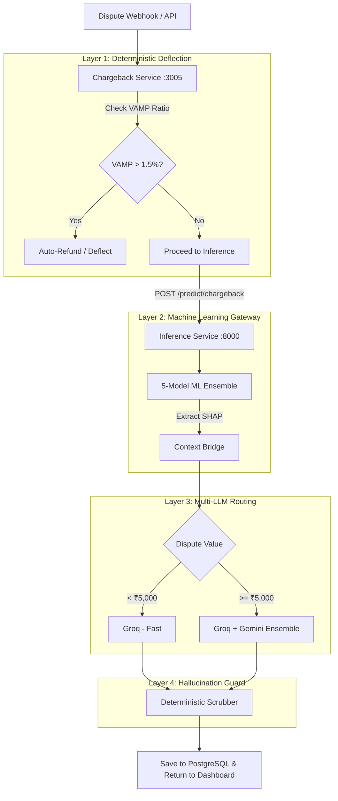

# Chargeback Service — High-Level Design (HLD)

**Version:** 1.0  
**Author:** Engineering Team  
**Status:** Approved  

---

## 1. Problem Statement
Handling payment chargebacks and disputes is a deeply manual, labor-intensive process that scales linearly with payment volume. Merchants lose millions of dollars not just to fraud, but to "Friendly Fraud" (first-party misuse) simply because assembling the exact evidence packets and writing compelling rebuttals to banking institutions takes too much human time before the deadline expires.

## 2. Solution Overview
The **Chargeback Pre-emption Service** entirely automates the dispute resolution lifecycle using a sophisticated 4-layer pipeline combining deterministic rules, heavy Machine Learning, and Multi-LLM ensembles.

It intercepts incoming dispute webhooks, predicts the probability of winning the dispute, automatically drafts a highly professional, legal-grade rebuttal letter tailored to the specific bank/network reason codes, and returns it to the dashboard. 

## 3. High-Level Architecture

## 4. Key Design Decisions

1. **VAMP Protection First:** The service prioritizes the merchant's Visa/Mastercard health (VAMP ratio) above all else. If fighting a dispute risks breaching the 1.5% threshold, the service overrides the ML model and recommends an instant refund.
2. **Centralized ML Inference:** Heavy dependencies like `xgboost` and `lightgbm` are NOT bundled in this service. It queries the `inference-service` over HTTP to get the win probability and SHAP (SHapley Additive exPlanations) values.
3. **Cost-Aware LLM Routing:** Generating text with LLMs is expensive. For low-value disputes (< ₹5,000), it uses a single fast LLM (Groq). For high-value disputes, it runs a Multi-LLM ensemble in parallel (Groq + Gemini) and scores them to find the best response.
