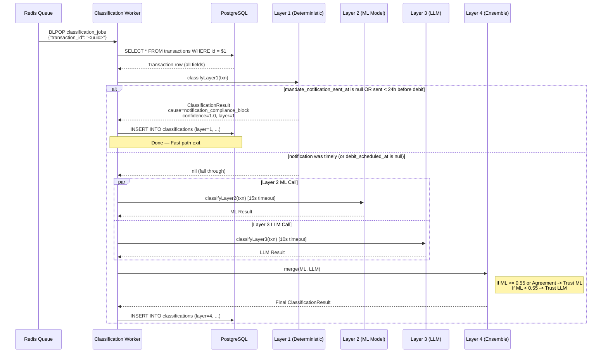

# Classification Flow — Layer 1 → Layer 2 → Persist

**Service:** Classification Service (queue worker)  
**Trigger:** Job dequeued from `classification_jobs` Redis list

---

## Flow Diagram



---

## Layer 1 Decision Logic

```
IF txn.debit_scheduled_at IS NULL:
    → fall through to Layer 2 (cannot make determination)

required_deadline = debit_scheduled_at - 24h

IF mandate_notification_sent_at IS NULL
   OR mandate_notification_sent_at > required_deadline:
    → cause = notification_compliance_block
    → confidence = 1.0
    → action = silent_reschedule
ELSE:
    → fall through to Layer 2
---

## Layer 2, 3, and 4 Logic Details

The legacy stub heuristic has been fully replaced by the live **Mixture-of-Experts (MoE) ML + LLM Ensemble**. 
For a detailed mathematical and structural breakdown of the Layer 2 Random Forest and the Layer 4 Ensemble Tie-Breaker logic, please see [ml-pipeline.md](ml-pipeline.md).
