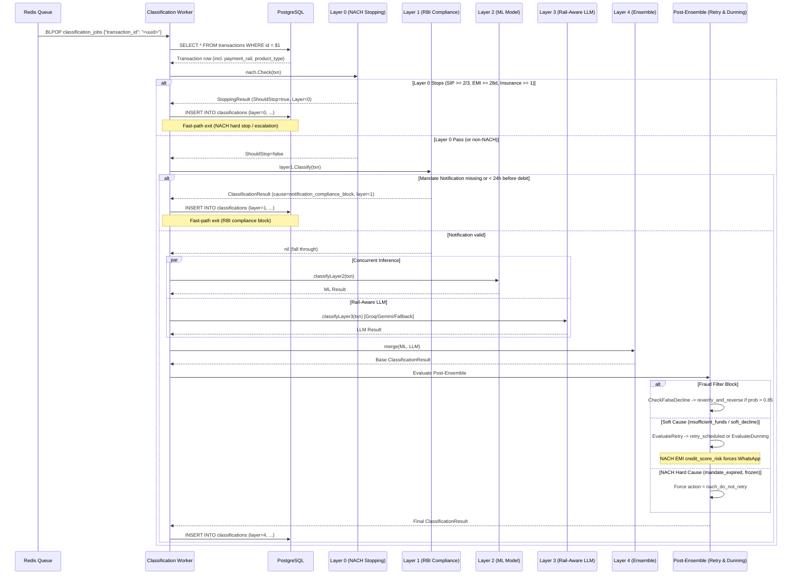

# Classification Flow — Layer 0 → Layer 1 → Ensemble → Post-Ensemble

**Service:** Classification Service (queue worker)  
**Trigger:** Job dequeued from `classification_jobs` Redis list

---

## Complete Pipeline Sequence Diagram



---

## Decision Logic Breakdown

### 1. Layer 0: NACH Mandate Stopping Logic
```
IF txn.payment_rail != "nach":
    → Continue to Layer 1

IF product_type == "sip":
    IF consecutive_failures >= 3:
        → Hard stop: Action = "sip_cancellation_risk_escalate", conf = 1.0 (AMC cancellation)
    IF consecutive_failures >= 2:
        → Pre-emptive: Action = "sip_cancellation_risk_escalate", conf = 0.95 (Protect mandate)

ELSE IF product_type == "loan_emi":
    IF days_since_due_date >= 28:
        → Action = "credit_score_risk_escalate", conf = 1.0 (2 days prior to 30-day reporting)

ELSE IF product_type == "insurance_premium":
    IF consecutive_failures >= 1:
        → Action = "policy_lapse_risk_escalate", conf = 0.90 (Immediate coverage risk)
```

### 2. Layer 1: RBI 24h Pre-Debit Notification Logic
```
IF txn.debit_scheduled_at IS NULL:
    → Fall through to Layer 2

required_deadline = debit_scheduled_at - 24h

IF mandate_notification_sent_at IS NULL OR mandate_notification_sent_at > required_deadline:
    → Action = "silent_reschedule", Cause = "notification_compliance_block", Layer = 1
```
