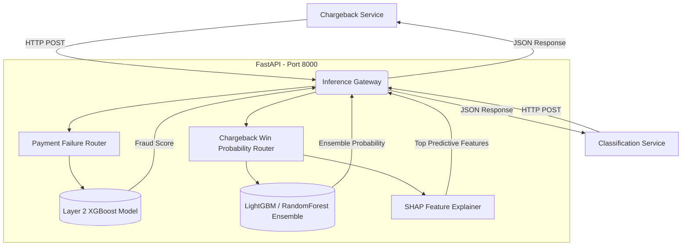

# Inference Gateway Architecture

## Overview
The **Inference Service** serves as the centralized machine learning gateway for the Razorpay Enterprise Monorepo. Built with FastAPI and Python 3.11, it abstracts away all heavy ML computations (XGBoost, LightGBM, Scikit-Learn) from the lightweight application services (`chargeback-service`, `classification-service`).

By isolating the ML inference layer, we achieve:
1. **Reduced Resource Footprint**: Go and lightweight Python APIs no longer need to bundle gigabytes of ML dependencies (`nvidia-nccl`, `llvmlite`, `scipy`).
2. **Centralized Model Management**: All `.pkl` model artifacts and scalers are loaded into a single location (`/app/models/`).
3. **Independent Scaling**: The ML tier can be scaled independently on GPU-backed or memory-optimized instances without scaling the entire backend.

## System Architecture

## Component Details

### 1. Payment Failure Routing
Handles incoming transactions to predict layer-2 payment failures.
- **Model**: Custom XGBoost Classifier.
- **Features**: Real-time transaction metadata.

### 2. Chargeback Dispute Classification
Provides robust win probability estimation for chargeback representation.
- **Model**: Multi-model ensemble (Logistic Regression, Decision Trees, Gradient Boosting) using hard-voting/averaging.
- **Explainability**: Generates SHAP values to extract the Top 3 defining features (e.g., `has_3ds_auth`, `days_remaining`) which are subsequently passed to the LLM agent for drafting contextual rebuttals.
- **Variance Check**: Computes standard deviation across the ensemble to detect structural model disagreement, triggering "VAMP Adjudication" safe-fallbacks.

## Docker Dependencies
The Docker image is built using `python:3.11-slim` and specifically requires the `libgomp1` apt package to successfully execute LightGBM models.
