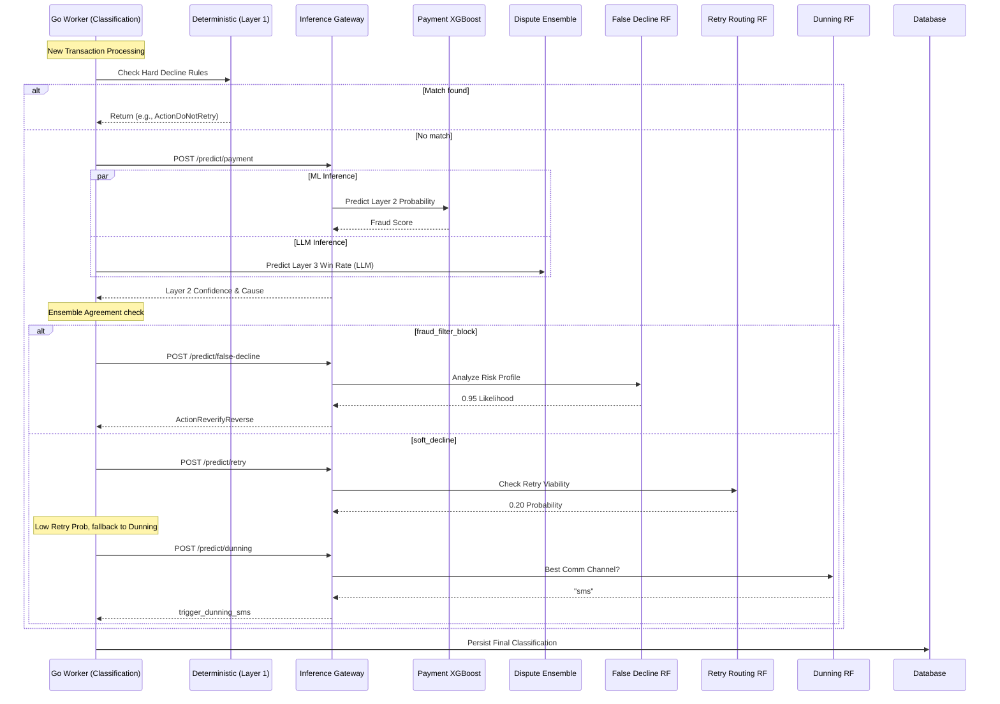
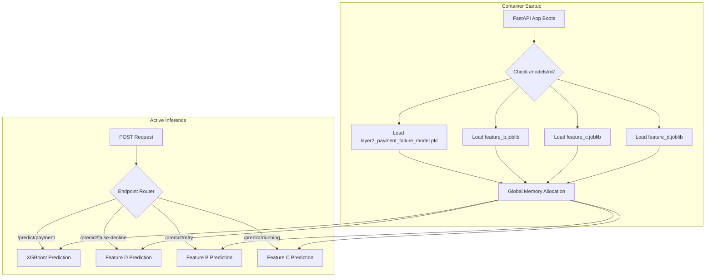

# Inference Service Flow Diagrams

The Inference Service acts as the centralized Machine Learning Gateway for the Razorpay Enterprise backend. It exposes multiple REST endpoints designed to be called asynchronously by high-throughput worker orchestrators (like the Classification Service).

## 1. Mixture of Experts Orchestration

This diagram illustrates how the `classification-service` leverages the `inference-service` to resolve root-cause classifications, including fallback mechanisms to `False Decline`, `Retry Routing`, and `Dunning Optimization`.

## 2. In-Memory Model Management

All models are built via offline training scripts and deployed as `.joblib` or `.pkl` artifacts. The FastAPI application strictly loads these into memory **once** on container startup to prevent disk I/O bottlenecks.

